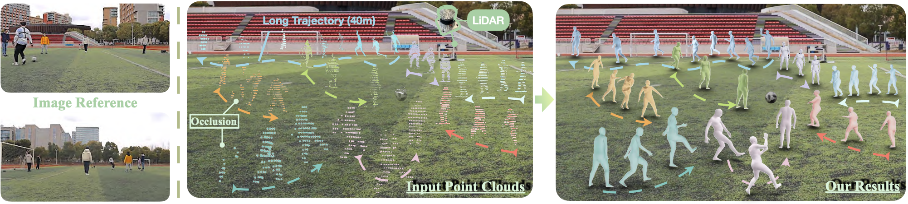

<p align="center">
  <h1 align="center">LiveHPS: LiDAR-based Scene-level Human Pose and Shape Estimation in Free Environment</h1>
  <h3 align="center"><a href="https://arxiv.org/abs/2402.17171.pdf">Paper</a> | <a href="https://youtu.be/a-msbGlQ3yc">Video</a> | <a href="https://drive.google.com/drive/folders/1BRpczJHyzte4NNTrTZVHzU6MZu4hTbAz?usp=drive_link">Dataset</a> | <a href="https://4dvlab.github.io/project_page/LiveHPS.html">Project Page</a></h3></p>

*The source code of our work "LiveHPS: LiDAR-based Scene-level Human Pose and Shape Estimation in Free Environment", accepted to CVPR 2024 Highlight*

<p align="center">
  <a href="">
    
  </a>
</p>
<hr>

## Abstract
*For human-centric large-scale scenes, fine-grained modeling for 3D human global pose and shape is significant for scene understanding and can benefit many real-world applications. In this paper, we present LiveHPS, a novel single-LiDAR-based approach for scene-level Human Pose and Shape estimation without any limitation of light conditions and wearable devices. In particular, we design a distillation mechanism to mitigate the distribution-varying effect of LiDAR point clouds and exploit the temporal-spatial geometric and dynamic information existing in consecutive frames to solve the occlusion and noise disturbance. LiveHPS, with its efficient configuration and high-quality output, is well-suited for real-world applications. Moreover, we propose a huge human motion dataset, named FreeMotion, which is collected in various scenarios with diverse human poses, shapes and translations. It consists of multi-modal and multi-view acquisition data from calibrated and synchronized LiDARs, cameras, and IMUs. Extensive experiments on our new dataset and other public datasets demonstrate the SOTA performance and robustness of our approach.*
<hr>

## Usage
### Prepare SMPL body model
1. Download SMPL model from [here](https://smpl.is.tue.mpg.de/). You should click `SMPL for Python` and download the `version 1.0.0 for Python 2.7 (10 shape PCs)`.
2. We also prepare the SMPL from [here](https://drive.google.com/file/d/1n87YRtYIsb2zfT9_NGx8ZHVtJRuq02aI/view?usp=sharing), you can download and update the `smpl` directory.
### Prepare the data and pretrained model
Download the FreeMotion indoor data and our pretrained model livehps.t7 from [here](https://drive.google.com/drive/folders/1BRpczJHyzte4NNTrTZVHzU6MZu4hTbAz?usp=drive_link).

### Example

```Shell
python test.py
```
